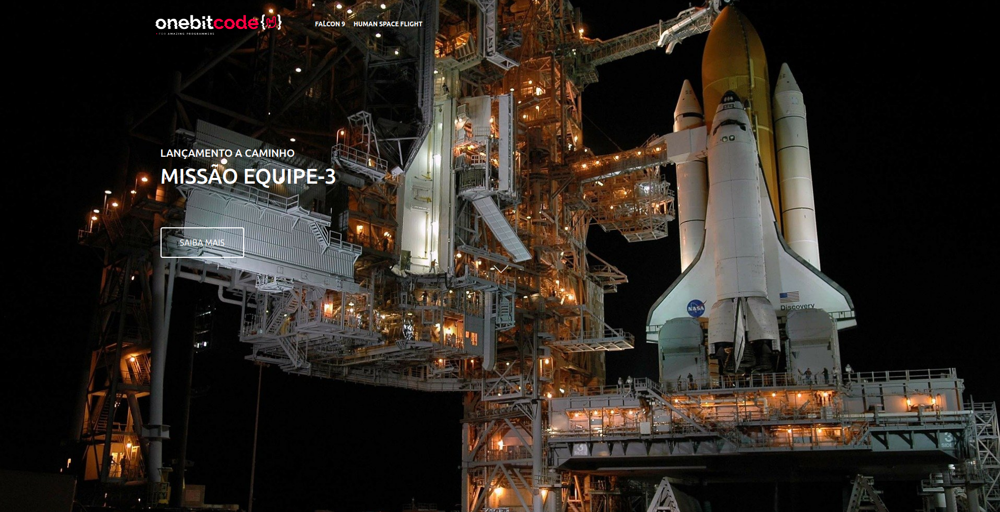
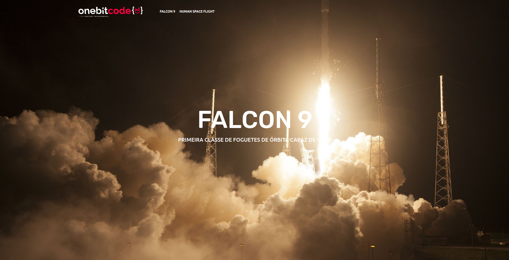

<h1 align="center">Site Clone da SpaceX</h1>
<p align="center">Esse site é uma espécie de clone do site da SpaceX, realizado no curso Programador Full Stack JavaScript Profissional, da OneBitCode.</p>
</br>
<p align="center">
<a href="https://github.com/marcelosarinho/projeto_clone_spacex/issues"></a>
<a href="https://github.com/marcelosarinho/projeto_clone_spacex/network"></a>
<a href="https://github.com/marcelosarinho/projeto_clone_spacex/stargazers"></a>
</p>
<p align="center">
<a href="#sobre">Sobre</a> • 
<a href="#pre-requisitos">Pré-Requisitos</a> • 
<a href="#tecnologias">Tecnologias</a> • 
<a href="#licenca">Licença</a> •
<a href="#autor">Autor</a>
</p>
<h4 align="center"> ✔️ Projeto finalizado! ✔️ </h4>
<h1></h1>
<h2>🌐 Demonstração</h2>
<div>
  <h3 align="center">
  
  </h3>
  <br/>
  <h3 align="center">
   
  </h3>
  <br/>
  <h3 align="center">
   
  </h3>
</div>
<h2 id="sobre">📖 Sobre</h2>
<p>Esse repositório é um clone do site da SpaceX, e foi realizado no curso Programador Full Stack JavaScript Profissional, da OneBitCode. Ele não possui a parte de JavaScript, sendo, portanto, um projeto que serve de prática para HTML, CSS, SASS e Bootstrap.</p>
<h2 id="pre-requisitos">📋 Pré-Requisitos</h2>
<p>Para testar essa aplicação, é necessário <a href="https://git-scm.com/">Git</a> e <a href="https://www.npmjs.com/">npm</a> (ou <a href="https://yarnpkg.com/">Yarn</a>).</p>
<p>Caso queira testar o projeto na sua máquina, siga esses passos:</p>

```bash
# Clone o repositório
$ git clone <https://github.com/marcelosarinho/portfolio>

# Acesse a pasta do projeto clonado
$ cd portfolio

# Instale as dependências necessárias para o projeto
$ npm install

# Execute o comando
$ npm start

# O site aparecerá automaticamente, caso não apareça acesse <http://localhost:3000/>

```

<h2 id="tecnologias">💻 Tecnologias utilizadas</h2>


<br/>

<br/>
<a href="https://getbootstrap.com/"></a>
<br/>
<a href="https://sass-lang.com/"></a>
<br/>
<a href="https://michalsnik.github.io/aos/">• AOS</a>
<h2 id="licenca">📜 Licença</h2>
Esse projeto utiliza a Licença MIT.
<h2 id="autor">👨‍💻 Autor</h2>
<div align="center">
<a href="https://github.com/marcelosarinho">

</a>
<a href="https://github.com/marcelosarinho"><h3>Marcelo Sarinho</h3></a>
<h5>Contato</h5>
<a href="https://github.com/marcelosarinho"></a>
<a href="https://www.linkedin.com/in/marcelo-sarinho-a4706923a/"></a>
<a href="mailto:marceloactsarinho@gmail.com"></a>
</div>
